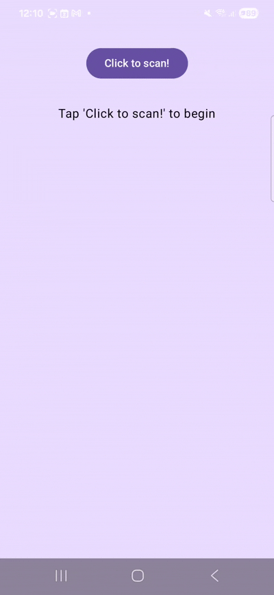
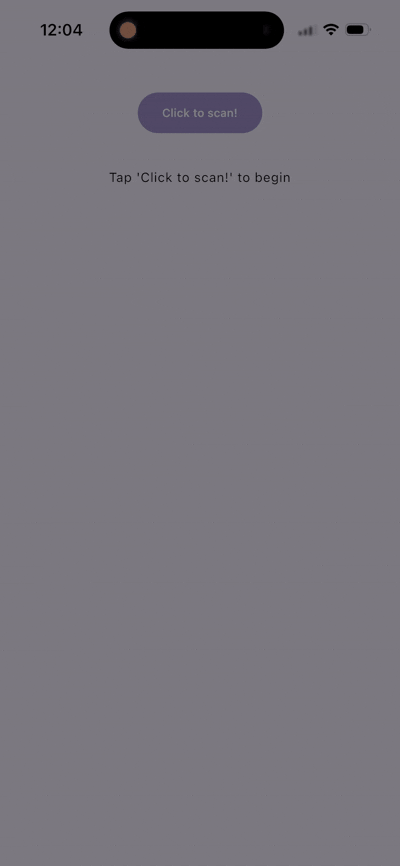

# NfcReaderKMP

[](http://kotlinlang.org)
[](https://www.jetbrains.com/lp/compose-multiplatform/)
[](https://opensource.org/licenses/MIT)
[](https://central.sonatype.com/artifact/io.github.dalafiarisamuel/nfcreader)
[](https://github.com/dalafiarisamuel/NfcReaderKMP/actions/workflows/validate-binary.yml)

A powerful, easy-to-use Kotlin Multiplatform (KMP) library for reading NFC tags on Android and iOS using Compose Multiplatform.

[**View Full API Documentation**](https://dalafiarisamuel.github.io/NfcReaderKMP/)

---

## 🚧 Work in Progress & Roadmap

This library is under active development. While we are approaching a stable `v1.0.0`, the core engine is already functional and powering NFC interactions on both Android and iOS.

### ✅ What's Ready
- **Unified KMP API**: A single `NfcReadManagerState` that handles platform complexities under the hood.
- **Android Implementation**: robust `NfcAdapter` integration with a customizable `ModalBottomSheet` and Lottie support (via [Compottie](https://github.com/AlexZhirkevich/compottie)).
- **iOS Implementation**: Seamless `CoreNFC` integration utilizing the native system scanning dialog.
- **Advanced Tag Parsing**: Support for NDEF, MIFARE, ISO15693, ISO7816, and FeliCa.
- **Dokka Documentation**: Fully documented API available [here](https://dalafiarisamuel.github.io/NfcReaderKMP/).
- **CI/CD**: Automated binary compatibility validation and publishing infrastructure.

### 🛠️ What's Next
- [ ] Increasing test coverage (Unit & Instrumentation).
- [ ] Polishing the `:composeApp` sample for more complex use cases.
- [ ] Official `v1.0.0` release to Maven Central.

> **Note:** We are currently at version `0.0.1`. The API is stabilizing but may still undergo minor changes before the first official release. Star the repo to stay updated!

---

## Features

- **Unified API**: A single, clean API to handle NFC scanning on both platforms.
- **Compose Native**: Lifecycle-aware state management that fits perfectly into your Compose UI.
- **Fully Customizable**:
    - **Android**: Custom Bottom Sheet with support for Lottie animations (via [Compottie](https://github.com/AlexZhirkevich/compottie)).
    - **iOS**: Seamless integration with the native system NFC scanning dialog.
- **Flexible Configuration**: Control timeouts, dismissal behaviors, and UI strings with a type-safe DSL.
- **Detailed Tag Info**: Extract Serial Numbers, NDEF payloads, and supported technology lists.

---

## Installation

Add the dependency to your `commonMain` source set in `build.gradle.kts`:

```kotlin
sourceSets {
    commonMain.dependencies {
        implementation("com.devtamuno.kmp:nfcreader:<version>")
    }
}
```

---

## Platform Setup

### Android

1. Add NFC permissions to your `AndroidManifest.xml`:
```xml
<uses-permission android:name="android.permission.NFC" />
<uses-feature android:name="android.hardware.nfc" android:required="false" />
```

### iOS

1. Add `NFCReaderUsageDescription` to your `Info.plist`.
2. Enable the **Near Field Communication Tag Reading** capability in your Xcode project.
3. Add `NDEF` support to the `com.apple.developer.nfc.readersession.formats` entitlement.

---

## Usage

### 1. Initialize the State Manager

Create an `NfcConfig` and pass it to `rememberNfcReadManagerState`. You can optionally provide a custom animation slot:

```kotlin
val nfcManager = rememberNfcReadManagerState(
    config = NfcConfig(
        titleMessage = "Ready to Scan",
        subtitleMessage = "Hold your tag near the device.",
        buttonText = "Cancel",
        android = NfcConfig.AndroidOptions(
            nfcReadTimeout = 30.seconds,
            shouldDismissBottomSheetOnBackPress = true
        )
    ),
    nfcScanningAnimationSlot = {
        // Custom Compose animation here
        Text("Scanning...")
    }
)
```

### 2. Observe Results

Collect the `nfcReadResult` and react to different scanning states:

```kotlin
val result by nfcManager.nfcReadResult.collectAsState()

when (val state = result) {
    is NfcReadResult.Success -> {
        Text("Tag ID: ${state.data.serialNumber}")
        Text("Type: ${state.data.type}")
        Text("Payload: ${state.data.payload}")
        Text("Technologies: ${state.data.techList.joinToString()}")
    }
    is NfcReadResult.Error -> {
        Text("Error: ${state.message}", color = Color.Red)
    }
    NfcReadResult.Scanning -> {
        Text("Scanning for NFC tag...")
    }
    NfcReadResult.OperationCancelled -> {
        Text("Scanning cancelled")
    }
    NfcReadResult.Initial -> {
        Button(onClick = { nfcManager.startScanning() }) {
            Text("Start Scanning")
        }
    }
}
```

---

## Configuration Options (`NfcConfig`)

`NfcConfig` groups configuration values by platform to make it clear where they are used, while still allowing them to be configured from common code using nested `AndroidOptions` and `IosOptions`.

### Core Properties
These properties are root-level and apply to both platforms (where supported).

| Property | Type | Default |
| :--- | :--- | :--- |
| `titleMessage` | `String` | Required |
| `subtitleMessage` | `String` | Required |
| `buttonText` | `String` | Required |
| `nfcUnsupportedMessage` | `String` | `"NFC is not supported on this device"` |
| `nfcDisabledMessage` | `String` | `"NFC is disabled on this device"` |
| `android` | `AndroidOptions` | `AndroidOptions()` |
| `ios` | `IosOptions` | `IosOptions()` |

### Android-Specific (`AndroidOptions`)
Accessed via `config.android`.

| Property | Type | Default | Validation |
| :--- | :--- | :--- | :--- |
| `nfcReadTimeout` | `Duration` | `60.seconds` | Min 5s |
| `nfcScanTimeoutMessage` | `String` | `"NFC scan timed out"` | Non-blank |
| `sheetGesturesEnabled` | `Boolean` | `true` | - |
| `shouldDismissBottomSheetOnBackPress` | `Boolean` | `false` | - |
| `shouldDismissBottomSheetOnClickOutside` | `Boolean` | `false` | - |

### iOS-Specific (`IosOptions`)
Accessed via `config.ios`.

| Property | Type | Default | Validation |
| :--- | :--- | :--- | :--- |
| `nfcSuccessMessage` | `String` | `"Tag scanned successfully"` | Non-blank |

> **Note:** All string properties (`titleMessage`, `subtitleMessage`, `buttonText`, etc.) are validated to be non-blank. On iOS, only `subtitleMessage` and `ios.nfcSuccessMessage` are used by the native system dialog. `titleMessage` and `buttonText` are required for the common UI but are ignored by CoreNFC.

---

## Data Models

### `NfcTagData`
- `serialNumber`: The tag's unique ID as a hex-encoded string (available on both Android and iOS).
- `type`: The tag type as an `NfcTagType` enum — see values below.
- `payload`: The decoded string content of the tag. `null` if the tag is empty or non-NDEF.
- `techList`: A list of hardware technologies detected (e.g., `"Mifare Classic"`, `"ISO 14443-3A"`).

### `NfcTagType`

| Value | Description |
| :--- | :--- |
| `NDEF` | NFC Data Exchange Format tag |
| `NON_NDEF` | Tag that does not contain NDEF data |
| `MIFARE` | MIFARE-based tag (Classic, Ultralight, DESFire) |
| `ISO15693` | ISO 15693 vicinity tag |
| `ISO7816` | ISO 7816-4 based smart card or tag |
| `FELICA` | Sony FeliCa tag (transit/payments) |

### `NfcReadResult`

| State | Description |
| :--- | :--- |
| `Initial` | No scan has been initiated yet |
| `Scanning` | Actively scanning for a tag |
| `Success(data)` | Tag was read successfully |
| `Error(message)` | An error occurred during scanning |
| `OperationCancelled` | Scanning was cancelled by the user or system |

---

## Demo

|                   Android Implementation                    |                   iOS Implementation                    |
|:-----------------------------------------------------------:|:-------------------------------------------------------:|
|  |  |

---

## Contributing

Contributions are welcome! Please feel free to submit a Pull Request.

---

## License

This project is licensed under the MIT License - see the [LICENSE](LICENSE) file for details.